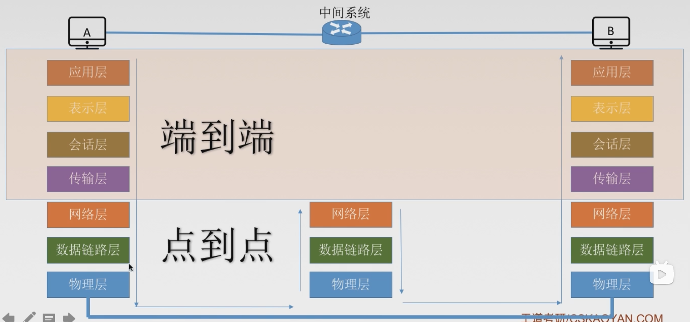

# 概述
## 组成部分
+ 硬件
+ 软件
+ 协议

## 工作方式
+ 边缘部分(用户直接使用),包括`C/S`方式和`P2P`方式。
+ 核心部分,为边缘部分服务,包括路由器和网络。

## 功能组成
按照计算机网络的两大功能**资源共享和数据通信**,可以将计算机网络划分为:
+ 通信子网(实现数据通信)
+ 资源子网(实现资源共享/数据处理)
下面是针对七层网络结构的划分图:

## 分类
1. 按照分布范围来分:
   + 广域网`WAN`
   + 城域网`MAN`
   + 局域网`LAN`
   + 个人区域网`PAN`.
2. 按照使用者来划分:
   + 公用网
   + 专用网
3. 按照交换技术来划分:
   + 电路交换
   + 报文交换
   + 分组交换
4. 按照拓扑结构来划分:
   + 总线型
   + 星型
   + 环形
   + 网状型(通常用于广域网)
5. 按照传输技术来分:
   + 广播式网络 共享公共通信信道
   + 点对点网络 使用分组存储转发和路由选择机制

## 标准化工作
`RFC(Request for Comments)`----因特网标准的形式 
`RFC`要上升为因特网正式标准的四个阶段:
1. 因特网草案(Internet Draft) 这个阶段还不是`RFC`文档，需要发往`rfc-editor@rfc-editor.org`进行审核。
2. 建议标准(Proposed Standard) 从这个阶段开始称为`RFC`文档。
3. 草案标准(Draft Standard) 需要提交到`IETF`，`IAB`进行审核(2011年废除)。
4. 因特网标准(Internet Standard)
从`2011`年开始,可以直接跳过第三阶段。

## 性能指标
### 关于速度的指标
1. 速率，又被称为数据率或数据传输率或比特率，连接在计算机网络上的主机在数字信道上单位时间内传送数据的位数，单位`b/s`，`kb/s`，`Mb/s`，`Gb/s`，`Tb/s`。在速率的转换上，`1kb/s = 10^3b/s`，`1Mb/s = 10^3kb/s`，每级转化以`10^3`为倍数，但是对于存储容量来说，并不是这样的，转化图如下所示：

1. 带宽，用来表示网络的通信线路传送数据的能力，通常是指单位时间内从网络中的某一点到另一点所能通过的最高数据率。单位是“比特每秒”。
也就是理论上网络设备所支持的最高速度。这里指的速率，全部都是针对将数据从网络节点传送到链路上的速率，而并不是在网络上传播的速度。
示意图：

1. 吞吐量，表示在单位时间内通过某个网络(或信道、接口)的数据量。单位`b/s`，`kb/s`，`Mb/s`等。吞吐量受网络的带宽或网络的额定速率的限制。

吞吐量是实际的，带宽是理想状态下的。
关于上面的这几个概念，可以参考下面的这几篇文章：
https://cloud.tencent.com/developer/article/1503274
https://blog.csdn.net/xiaofei0859/article/details/70037893
https://www.cnblogs.com/zhaojianwang/p/8391998.html

### 关于时间的指标
1. 时延，指数据(报文/分组/比特流)从网络(或链路)的一端传送到另一端所需的时间。也叫做延迟或迟延。单位是`s`。时间分为以下四种：
   
   + 发送时延(传输时延)：从发送分组的第一个比特算起，到该分组的最后一个比特发送完毕所需要的时间。 
   发送时延 = 数据长度 / 信道带宽(发送速率)
   + 传播时延：取决于电磁波传播速度和链路长度。
   传播时延 = 信道长度 / 电磁波在信道上的传播速率。
   + 排队时延：等待输出/入链路可用。
   + 处理时延：检错、找出口。

    示意图：
   

    高速链路实际上是通过缩短发送时延的方式来加快传输效率的，也就是通过提高带宽的手段，但是对于传播时延来说，主要取决于信道长度以及电磁波在信道上的传播速率，一般不会发生改变。

2. 时延带宽积，时延带宽积 = 传播时延 * 带宽。时延带宽积又称为以比特为单位的链路长度。
   

3. 往返时延RTT，从发送方发送数据开始，到发送方接受到接收方的确认(接收方收到数据后立即发送确认)，总共经历的时延。
   RTT越大，在收到确认之前，可以发送的数据越多。
   RTT包括：往返传播时延 = 传播时延 * 2 + 末端处理时间。

4. 利用率
   信道利用率 = 有数据通过时间 / (有 + 无)数据通过时间
   网络利用率 = 信道利用率加权平均值

## 分层
### 分层的基本原则
1. **各层之间相互独立**，每层只实现一种相互独立的功能。
2. 每层之间界面自然清晰，易于理解，相互交流尽可能少。
3. 结构上可分隔开。每层采用最合适的技术来实现。
4. 保持下层对上层的独立性，**上层单向使用下层使用的服务**。
5. 整个分层结构应该能促进标准化工作。

### 名词解释
1. 实体：第n层中的活动元素称为*n层实体*。同一层的实体叫做*对等实体*。
2. 协议：为进行网络中的*对等实体*数据交换而建立的规则、标准、约定，称为网络协议。【水平】
三要素：
   + 语法：规定传输数据的格式。
   + 语义：规定所要完成的功能。
   + 同步：规定各种操作的顺序。
3. 接口(访问服务点`SAP`)：上层使用下层服务的入口。
4. 服务：下层为相邻上层提供的功能调用。【垂直单向】
5. 传输的信息
   + `SDU`服务数据单元：为完成用户所要求的功能而应传送的数据。
   + `PCI`协议控制信息：控制协议操作的信息。
   + `PDU`协议数据单元(`PDU = PCI + PDU`)：对等层次之间传送的数据单位。(上一层的`PDU`作为下一层的`SDU`)。
   

   

### 分层结构
法定标准：7层`OSI`参考模型 
事实标准：4层`TCP/IP`参考模型 
我们一般学习的是5层体系结构

7层`OSI`参考模型：

 
这里需要注意的是，上面的四层只是**端到端**之间的通信，也就是说，对于上面的四层来说，通信的双方只有发送和接受消息的主机。但是对于中间系统来说，他们是点到点的通信，它们不需要包括完整的7层，最多只需要下面的3层(像路由器，可能需要下面的三层，但是像交换机、网桥，可能只需要最下面的两层。)

 

#### 应用层
所有能与用户交互产生网络流量的程序。 
典型应用层服务：
   + 文件传输(`FTP`)
   + 电子邮件(`SMTP`)
   + 万维网(`HTTP`)
#### 表示层
用于处理在两个通信系统中交换信息的表示方式(语法和语义)
   + 数据格式变换
   + 数据加密和解密
   + 数据的压缩以及恢复
#### 会话层
向表示层实体/用户进程提供**建立连接**并在连接上有序地传输数据。
这是会话，也是建立同步(SYN)
   + 建立、管理、终止会话
   + 使用校验点可使会话在通信失效时从校验点/同步点继续恢复通信，实现数据同步。
#### 应用层 + 表示层 + 会话层  
在上面的这三层，在五层结构中并称为应用层，`PDU`为`message`，也就是报文。

#### 传输层
负责主机中两个进程之间的通信，即端到端的通信。传输单位是报文段或用户数据报。(主机(或者说代表传输的目的地和出发地的两端)需要全部的7个层次，端到端通信代表的是两个进程之间的通信，每个进程都需要用一个端口号来代表它)
   + 可靠传输、不可靠传输
   + 差错控制
   + 流量控制
   + 复用分用
    复用：多个应用层进程可同时使用下面运输层的服务。(这个过程发生在要发送端中，因为可能在发送端有多个进程在运行，这些个进程同时使用运输层的服务)
   分用：运输层把收到的信息分别交付给上面应用层中相应的进程(这个过程发生在接受端，因为收到的信息需要经过运输层的处理，交付给应用层中相应的进程)
主要的协议：`UDP`，`TCP`。
#### 网络层(又被称为网际层或者IP层)
主要的任务是把分组从源端传到目的端，为分组交换网上的不同主机提供通信服务。网络层传输单位是数据报。关于数据报(datagram)与分组(packet，又被称为包，用抓包工具抓到的一条条记录就是包)之间的关系，详情见下图，具体参考[这篇博客](https://www.cnblogs.com/wanpengcoder/p/7442794.html):

 

   + 路由选择
   + 流量控制
   + 差错控制
   + 拥塞控制
    若所有结点都来不及接受分组，而要丢弃大量分组的话，网络就处于拥塞状态。因此要采取一定措施，缓解这种拥塞。

主要的协议：`IP`、`IPX`、`ICMP`、`IGMP`、`ARP`、`RARP`、`OSPF`
#### 数据链路层
主要任务是把网络层传下来的数据报组装成帧。数据链路层/链路层的传输单位是帧。
   + 成帧(定义帧的开始和结束)
   + 差错控制(帧错+位错)
   + 流量控制
   + 访问(接入)控制 控制对信道的访问
主要协议：`SDLC`、`HDLC`、`PPP`、`STP`
#### 物理层
主要任务是在物理媒体上实现比特流的透明传输。物理层传输单位是比特。
透明传输：指不管所传6数据是什么样的比特组合，都应该能够在链路上传送。
   + 定义接口特性
   + 定义传输模式(单工、半双工、全双工)
   + 定义传输速率
   + 比特同步
   + 比特编码
主要协议：Rj45、802.3
## `OSI`参考模型和`TCP/IP`参考模型
### 示意图：

 

### 相同点
1. 都分层
2. 都是基于独立的协议栈
3. 可以实现异构网络的互联
### 不同点
1. `OSI`定义三点：服务、协议、接口
2. `OSI`先出现，参考模型先于协议发明，不偏向特定协议
3. `TCP/IP`设计之初就考虑到异构网互联问题，将IP作为重要层次(先发明了协议，之后抽象出了参考模型)
4. 
|  | `ISO/OSI`参考模型 | `TCP/IP`模型 |
| ------ | ------ | ------ |
| 网络层 | 无连接 + 面向连接 | 无连接 |
| 传输层 | 面向连接 | 无连接 + 面向连接 |
`IP`不是面向连接的协议。
### 5层参考模型(综合了`OSI`和`TCP/IP`的优点)

 

5层参考模型的数据封装和解封装

 

## 各层的传输单元
1. 应用层：报文(`message`)
2. 传输层：报文段(`segment`)
3. 网络层：数据报(`datagram`) 如果数据报过大的话，会被切分成为分组(`packet`)。
4. 数据链路层：帧(`frame`)
5. 物理层：比特(`bit`)