# 物理层
## 基本概念
物理层解决如何在连接各种计算机的传输媒体上传播数据比特流，而不是指具体的传输媒体(传输媒体也被称为第`0`层)。

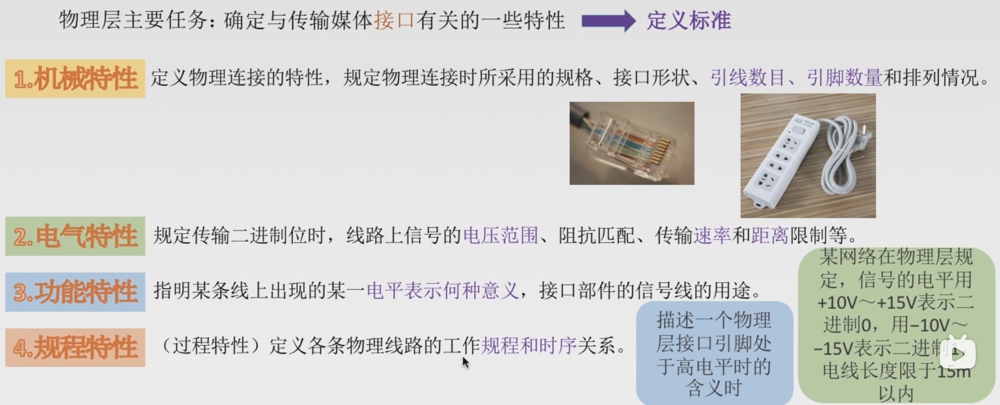

## 典型的数据通信模型

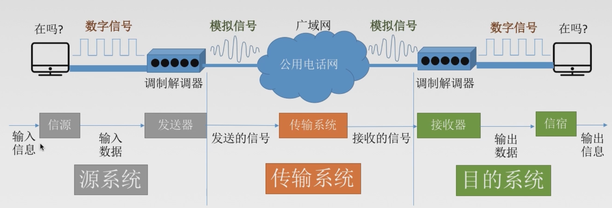

## 数据通信相关术语

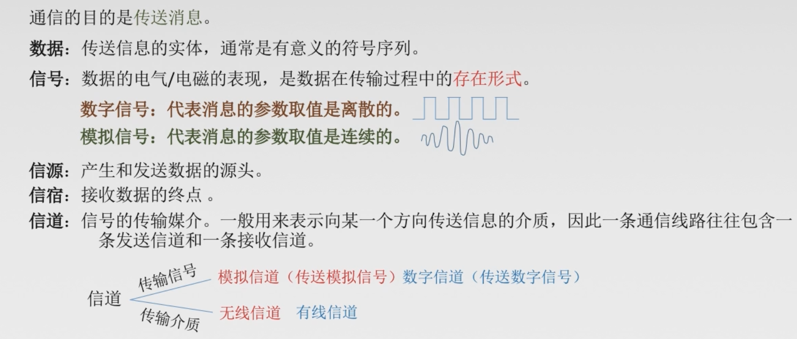

## 三种通信方式
1. 单工通信 只有一个方向的通信而没有反方向的交互，仅需要一条信道。
2. 半双工通信 通信的双方都可以发送或接受信息，但任何一方都不能同时发送和接收，需要两条信道。
3. 全双工通信 通信双方可以同时发送和接受信息，也需要两条信道。

## 两种数据传输方式
1. 串行传输 速度慢，费用低，适合远距离
2. 并行传输 速度快，费用高，适合近距离

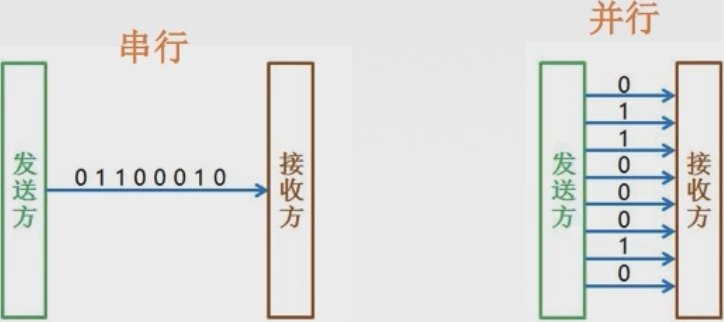

## 码元

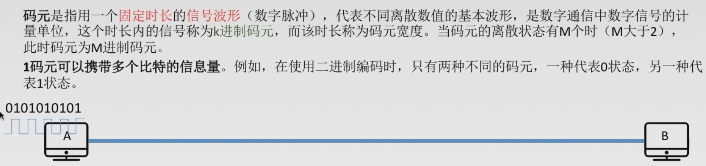

## 速率、波特、带宽
速率也叫数据率，是指数据的传输速率，表示单位时间内传输的数据量。可以用**码元传输速率**和**信息传输速率**表示。

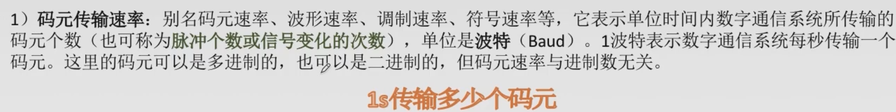

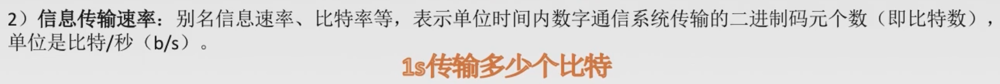

一个码元就是一个脉冲信号！波特率指的就是`1`秒能发送多少个码元，也就是1秒能发送多少个脉冲信号！ 
一个码元能携带`1bit`数据，那么比特率 = 波特率！ 
一个码元能携带`2bit`数据，那么比特率 = 2倍的波特率！ 
一个码元能携`4bit`数据，那么比特率 =4倍的波特率！ 
若一个码元携带`n bit`的信息量，则`M Baud`的码元传输速率所对应的信息传输速率为`M * n bit/s`。
带宽：表示在单位时间内从网络中的某一点到另一点所能通过的“最高数据率”，常用来表示网络的通信线路所能传输数据的能力。单位是`b/s`。

## 奈氏准则和香农定理
### 失真

码间串扰

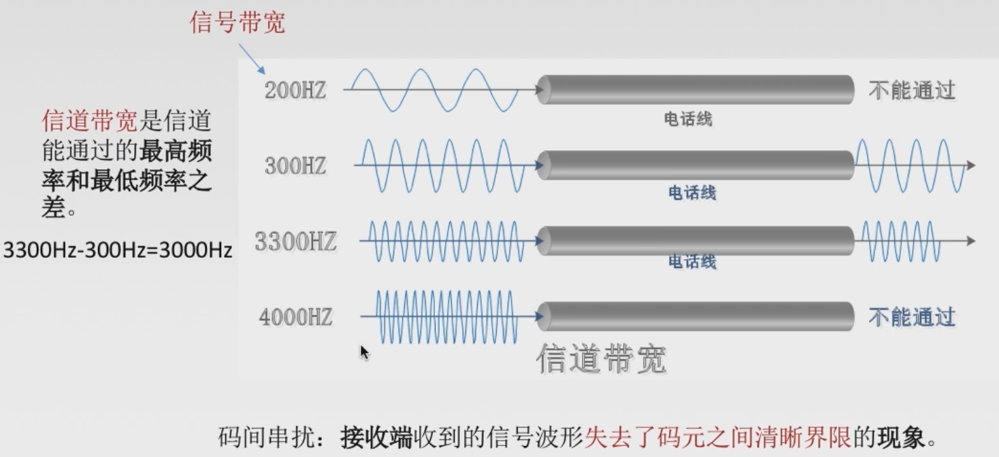

### 奈氏准则(奈奎斯特定理)
在理想低通(无噪音，带宽受限)条件下，为了避免码间串扰，极限码元传输速率`2W Baud`，`W`是信道带宽，单位是`Hz`。
理想低通信道下的极限数据传输率=$2W\log_2V$，单位是`bit/s`，
`V`代表一共有几种码元(码元的离散电平数目)

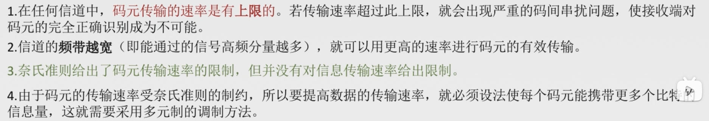

### 香农定理

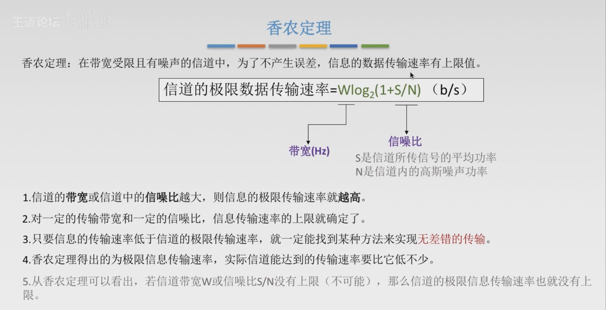

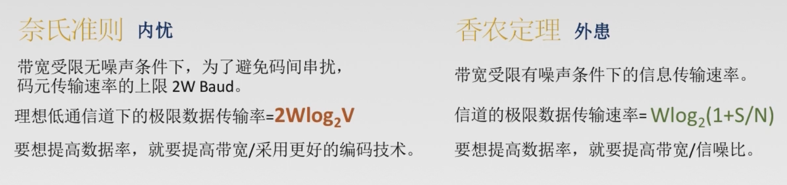

## 编码和调制
### 基带信号与宽带信号
基带信号: 像计算机输出的代表各种文字或图像文件的数据信号都属于基带信号。基带信号往往包含有较多的低频成分，甚至有直流成分，而许多信道并不能传输这种低频分量或直流分量。因此必须对基带信号进行调制。在数据信道上传输(基带传输)。 
宽带信号: 也被称为带通信号，把基带信号经过载波调制后，把信号的频率范围搬移到较高的频段以便在信道中传输。

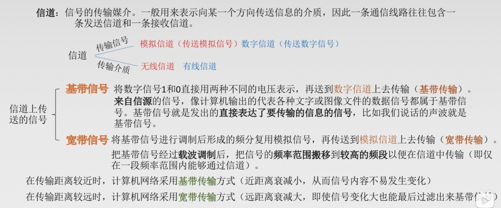

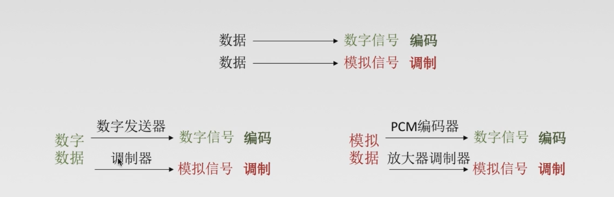

### 数字数据编码为数字信号
+ 非归零编码[NRZ]
+ 曼切斯特编码
+ 差分曼切斯特编码
+ 归零编码[RZ]
+ 反向不归零编码[NRZI]
+ 4B/5B编码

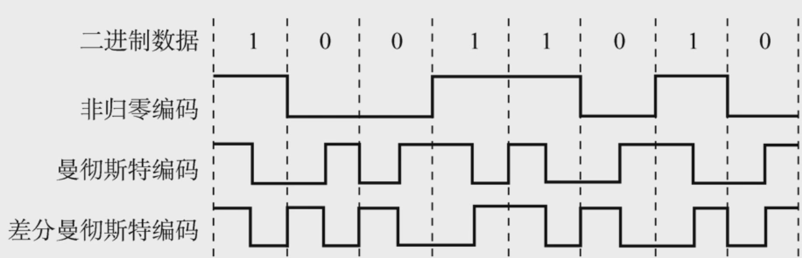

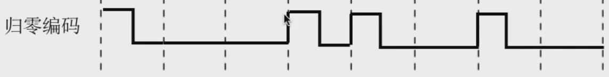

`RZ`编码也成为归零码，归零码的特性就是在一个周期内，用二进制传输数据位，在数据位脉冲结束后，需要维持一段时间的低电平。也就是用高电位表示`1`(也可以制定不同的规则，用高电平表示`0`)，在一个周期内，会变为低电平。

#### 非归零码、归零编码与反向不归零编码

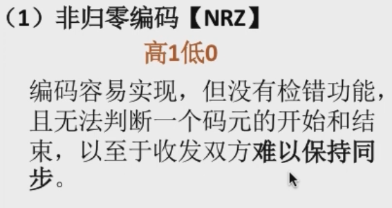

其中非归零编码和归零编码、反向不归零编码可能不能够传递过去**时钟周期的信息**，比如说，对于非归零编码的话，如果传递的数据是全`1`或者全`0`的话，就很难区分一共有多少个`0`，因为传递过来的信号是一条直线，并不容易判断多长一段(一个时钟周期)，归零编码和反向不归零编码同样也会出现这样的问题，归零编码在全`0`时会出现这样的问题，反向不归零编码会在全`1`的时候出现这样的问题。

#### 曼彻斯特编码与差分曼彻斯特编码

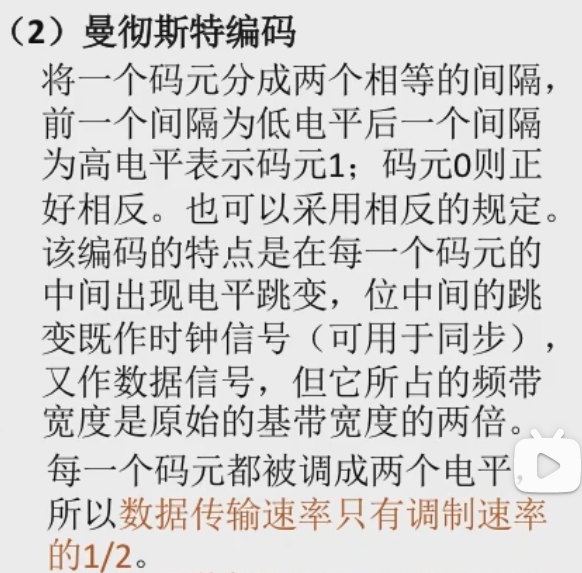

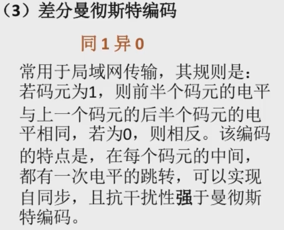

使用曼彻斯特编码，数据传输速率会成为调制速率的`1/2`，这里的数据传输速率指的就是单位时间内传递的比特数，尽管码元是二进制的，但是这里的一个码元也不能够代表一个比特，这里使用一个脉冲代表一个码元，所以在传递`1 bit`信息的时候，因为有两个脉冲，所以调制速率(单位时间传递的脉冲数或者码元数)是数据传输速率的两倍。
#### 4B/5B编码

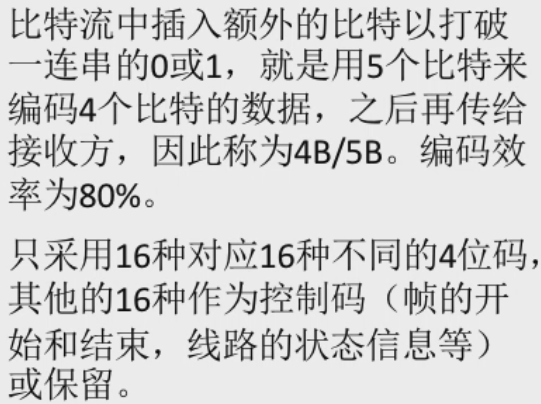

### 数字数据调制为模拟信号
+ 调幅 载波的振幅随基带数字信号而变化。(比如有振幅表示`1`，没有振幅表示`0`)
+ 调频 载波的频率随基带数字信号而变化。(比如频率比较高代表`1`，频率比较低，代表`0`)
+ 调相 载波的初始相位随基带数字信号而变化。

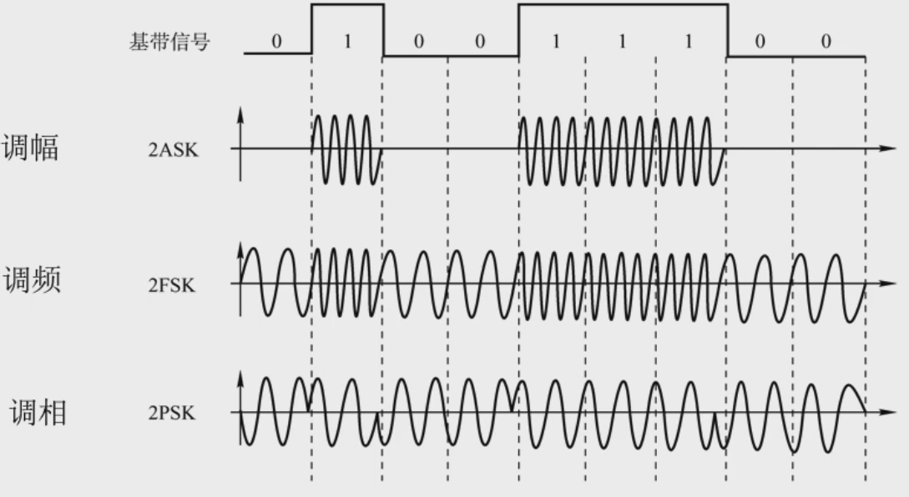

除了上面这三种之外，还有额外的一种调幅和调相结合起来的`QAM`。

### 模拟数据编码为数字信号

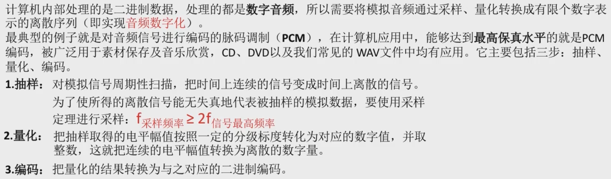

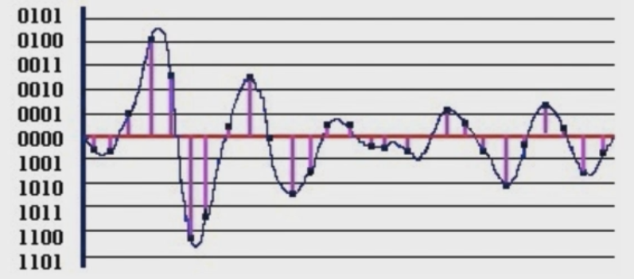

### 模拟数据调制为模拟信号

## 物理层设备
### 中继器

中继器是用来**再生数字信号**。

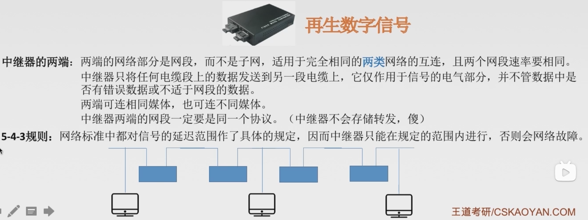

针对于`10M`的以太网来说：
> 我们知道网线的传输距离都是有限的﹐如果节点之间的距离太远﹐我们就需要在中间使用增益器(Repeater)来将信号放大后继续传输。如果使用802.3协定的时候﹐有一个原则我们是必需遵守的﹕五四三原则。意思就是网络上最多只能有﹕
>  * 5个网段(segment)。所谓segment就在物理连接上最接近的一组电脑﹐在一个BNC网段里面最多只能接30台电脑﹐且网线总长不能超过185m。
>  * 4个中继器(repeater)。也就是将信号放大的装置。
>  * 3个电脑群体(population)。这个不好理解﹐也就是说前面所说的5个segment之中﹐只能有3个可以装电脑﹐其它两个不行。

### 集线器(多口中继器)
作用与中继器类似，再生，放大信号。

集线器示意图:

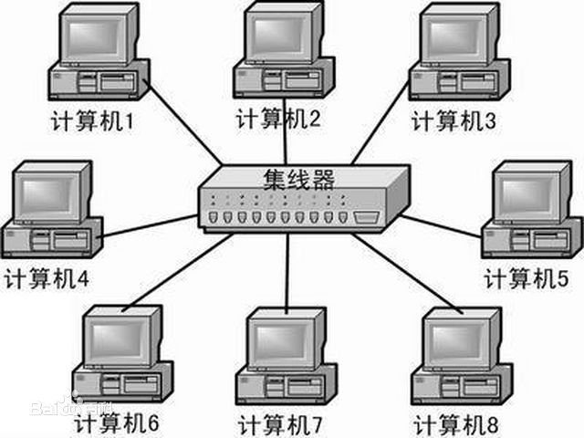

以下是集线器的一些特点： 
  + 广播
     也就是说当主机1在向主机2发送数据包的时候，要经过集线器转发，但是集线器是一个物理层设备，它收到数据包会以广播的形式。发往除了接收数据包接口以外的所有接口，这个就叫做广播。**这种广播造成了带宽的浪费，也造成了安全隐患，其他计算机可能会窃取到1向2发的数据包。**
  + 半双工设备（数据单方向传输）
     也就是说在同一时刻只能发送或者接收数据。
  + 所有设备处在同一个冲突域和广播域
     冲突域的概念：所有直接连接在一起的，而且必须竞争以太网总线的节点都可以认为是处在同一个冲突域中，说白了就是一次只有一个设备发送信息，其他的只能等待。
     广播域的概念：广播域是一个逻辑上的计算机组，该组内的所有计算机都会收到同样的广播信息。比如主机1发包给主机2，主机 3 4 5 6也能收到相同的数据包。
## 信道复用技术
为了提高信道的利用率，我们要使用信道的复用技术。

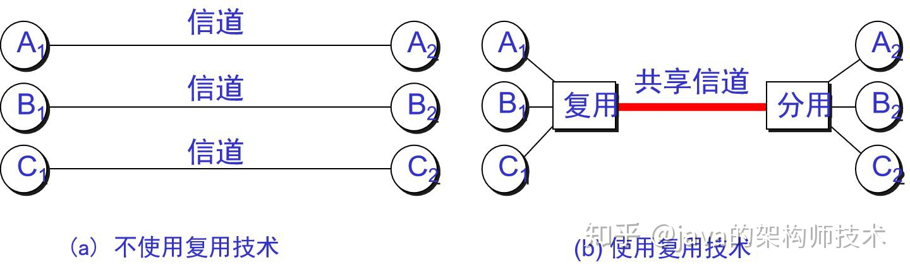

### 频分复用(FDM)

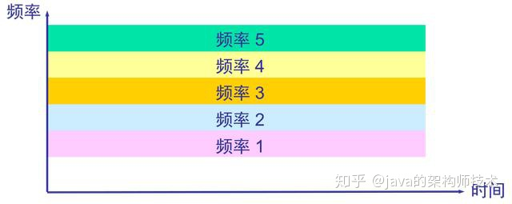

用户在分配到一定的频带后，在通信过程中自始至终都占用这个频带。频分复用的所有用户在同样的时间占用不同的带宽资源。
在这里不同的颜色就可以代表不同的用户，他们在同样的时间占用了不同的带宽。

### 时分复用(TDM)

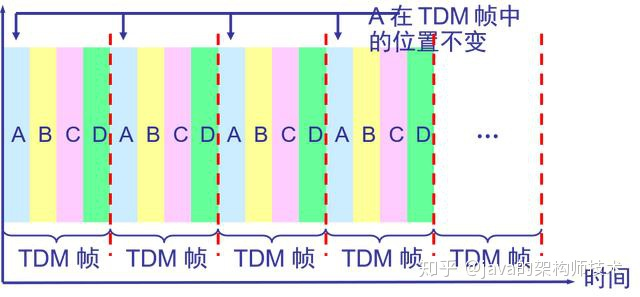

时分复用则是将时间划分为一段段等长的时分复用帧(`TDM`帧)。每一个时分复用的用户在每一个`TDM`帧中占用固定序号的时隙。时分复用的所有用户是在不同的时间占用同样的频带宽度。

### 波分复用(WDM)
波分复用就是光的频分复用

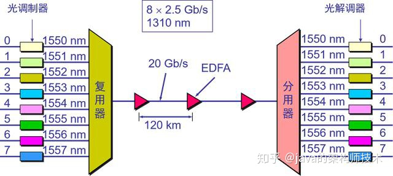

### 码分复用(CDM)
也被称为`CDMA`，每一个用户可以在同样的时间使用同样的频带进行通信，由于各用户使用经过特殊挑选的不同码型，因此各用户之间不会造成干扰。
在`CDMA`中，每一个比特时间在划分为`m`个短的间隔，称为码片(`chip`)，通常`m`的值为`64`或`128`，为了方便说明，取`m`为`8`。
1. 使用`CDMA`的每一个站被指派一个唯一的`m bit`码片序列，一个站如果要发送比特`1`，则发送它自己的`m bit`码片序列，如果要发送`0`，则发送该码片序列的二进制反码，按照惯例将码片中的`0`写成`-1`，将`1`写成`+1`。
2. `CDMA`给每一个站分配的码片序列不仅必须各不相同，并且还必须互相正交，用数学公式表示，令向量`S`表示站`S`的码片向量，再令`T`表示其他任何站的码片向量。两个不同站的码片序列正交，就是向量`S`和`T`的规格化内积都是`S * T =  0`。
3. 任何一个码片向量和该码片向量自己的规格化内积都是`S * S  =  1`。
4. 任何一个码片向量和该码片的反码的向量的规格化内积都是`-1`。
详情可以参考这篇文章: https://blog.csdn.net/u011240016/article/details/52705205

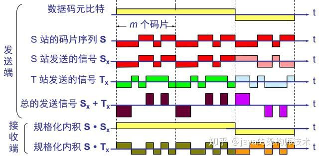
