# 链路层
## 基本概念
结点：主机、路由器 
链路：网络中两个结点之间的**物理通道**，链路的传输介质主要有双绞线、光纤和微波。分为有线链路和无线链路。 
数据链路：网络中两个结点之间的**逻辑通道**，把实现控制数据传输协议的硬件和软件加到链路上构成数据链路。 
帧：链路层的协议数据单元，封装网络层数据报。 
数据链路层负责通过一条链路从一个结点向另一个物理链路直接相连的相邻结点传送数据报。

## 功能概述
数据链路层在物理层提供服务的基础上**向网络层提供服务**，其最基本的服务是将源自网络层来的数据可靠地传输到相邻节点的目标机网络层。其主要作用是**加强物理层传输原始比特流的功能**，将物理层提供的可能出错的物理连接改造成**逻辑上无差错的数据链路**，使之对网络层表现为一条无差错的链路。
+ 为网络层提供服务。无确认无连接服务，有确认无连接服务，有确认面向连接服务。(有连接一定有确认)
+ 链路管理，即连接的建立、维持、释放(用于面向连接的服务)
+ 组帧
+ 流量控制
+ 差错控制(帧错/位错)

## 封装成帧&透明传输
**封装成帧**就是在一段数据的前后部分添加首部和尾部，这样就构成了一个帧。接收端在收到物理层上交的比特流后，就能够根据首部和尾部的标记，从收到的比特流中识别帧的开始和结束。 
首部和尾部包含许多控制信息，他们的一个重要作用:帧定界(确定帧的界限)。 
帧同步: 接收方应当能从接受到的二进制比特流中区分出帧的起始和终止。
组帧的四种方法：
1. 字符计数法
2. 字符(节)填充法
3. 零比特填充法
4. 违规编码法

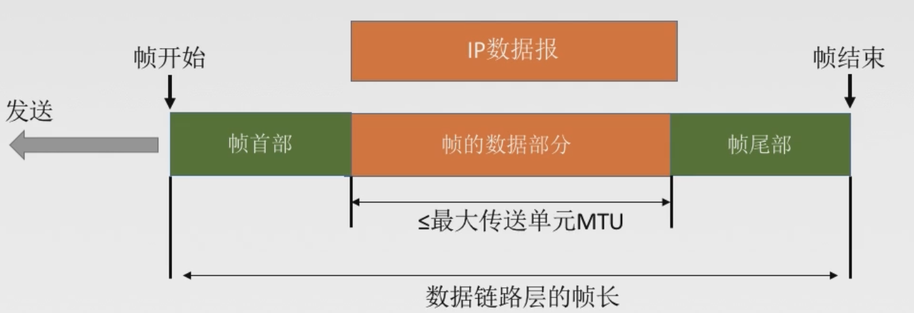

透明传输是不管所传数据是什么样的比特组合，都应该能够在链路上传送。因此，链路层就“看不见”有什么妨碍数据传输的东西。 
当所传数据中的比特组合恰巧与某一个控制信息完全一样时，就必须采取适当的措施，使接受方不会将这样的数据误认为是某种控制信息。这样才能够保证数据链路层的传输是透明的。

### 字符计数法
帧首部使用一个计数字段(第一个字节，八位)来标明帧内字符数。

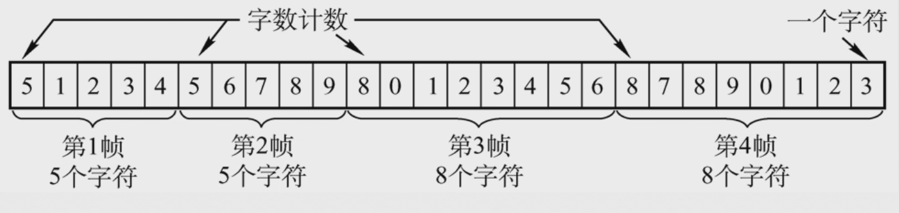

### 字符填充法

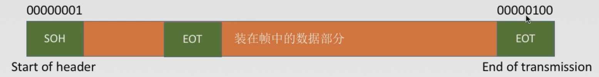

当传送的帧是由文本文件组成时(文本文件的字符都是从键盘上输入的，都是`ASCII`码)。不管从键盘上输入什么字符都可以放到帧里面传过去，即透明传输。这是因为在首部和尾部添加的控制信息不可能与`ASCII`码产生冲突。
当传送的帧是由非`ASCII`码的文本文件组成时(二进制代码的程序或图像等)。就要**采用字符填充方法实现透明传输**。

字符填充法采用的方法就是在帧的数据部分中与特定字符相同的字符被误判首位定界符`EOT`和`SOH`，可以在这些特殊字符前面填充一个转义字符`ESC`加以区分，以实现数据的透明传输.

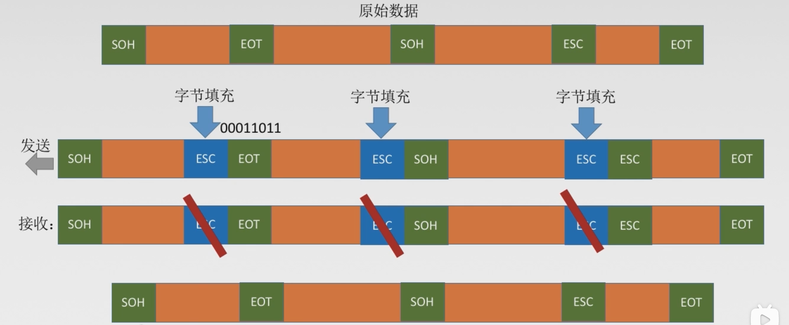

### 零比特填充法
这种方法允许数据帧中包含任意个数的比特。 
使用一个特定的比特模式，即`0 1 1 1 1 1 0`来标志一帧的开始和结束。 
操作:
1. 在发送端，扫描整个字节字段，只要连续`5`个`1`，就立即填入一个`0`； 
2. 在接收端收到一个帧时，先找到标识字段确定边界，再用硬件对比特流进行扫描，发现连续`5`个`1`时，就把后面的`0`删除。
保证了透明传输：在比特流中可以传输任意比特组合，而不会引起对帧边界的错误判断

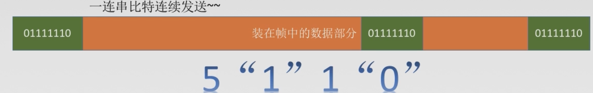

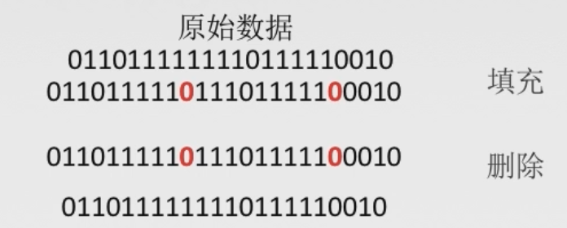

 
### 违规编码法
在物理层比特编码的时候，实现透明传输的一种方法。局域网的`IEEE 802`标准就采用了这种方法。用没有采用到的电平来定界帧的开始和结束。例如：

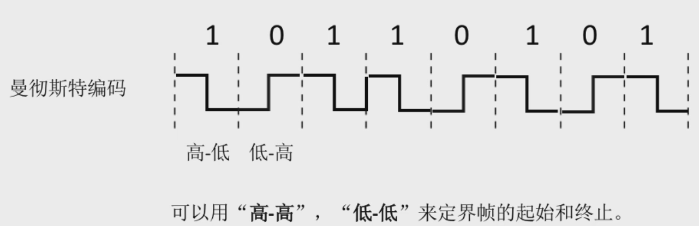

由于字节计数法中`Count`字段的脆弱性(其值若有差错将导致灾难性后果)以及字符填充实现上的复杂性和不兼容性，现在较普遍使用的帧同步法是**比特填充和违规编码法**。

## 差错控制
传输中的差错都是由于噪声引起的。
噪声分为两种，如下图所示：

产生的差错也分为两种:
+ 位错 比特位出错，`1`变成`0`，`0`变成`1`.
+ 帧错 
    + 丢失
    + 重复
    + 失序

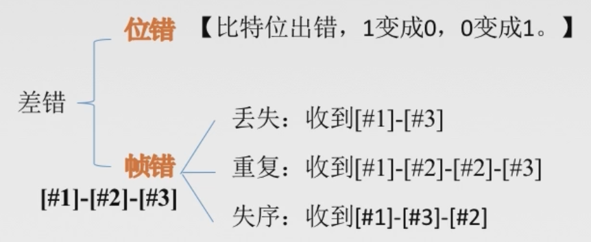

链路层会根据传输链路的质量来为网络层提供不同的服务：

对于通信质量好的有线传输链路：
+ 无确认无连接服务

对于通信质量差的无线传输链路：
+ 有确认无连接服务
+ 有确认面向连接服务

解决位错时，有两种不同的编码，**检错编码**和**纠错编码**：

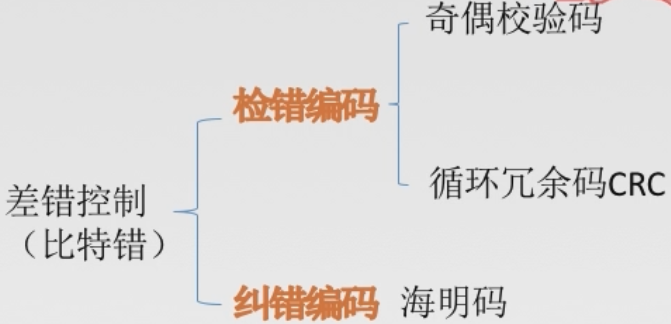

冗余编码：在数据发送之前，先按某种关系附加上一定的**冗余位**，构成一个符合某一规则的码字后再发送。当要发送的有效数据变化时，相应的冗余位也随之变化，使码字遵从不变的原则。接受端根据收到的码字是否符合原规则，从而判断是否出错。

### 检错编码
#### 奇偶校验码
奇偶校验码是指`n - 1`位信息元和`1`位校验元，而该校验元就是冗余编码。奇校验码就是保证这`n`位中，`1`的个数为奇数，偶校验元是保证这`n`位中`1`的个数为偶数。

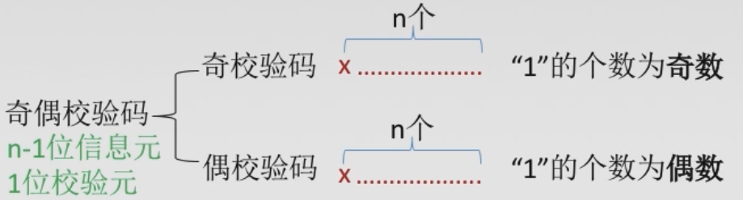

只能检查出**奇数个比特**错误，检错能力为50%。

#### `CRC`循环冗余码
原理：任意一个由二进制位串组成的代码都可以和一个系数仅为`0`和`1`取值的多项式一一对应。例如:代码`1010111`对应的多项式为`x^6+x^4+x^2+x+1`，而多项式为`x^5+x^3+x^2+x+1`对应的代码`101111`。 
给定一个`m bit`的帧或报文，发送器生成一个`r bit`的序列，称为帧检验序列`FCS`。这样所形成的帧将由`m + r bit`比特组成。发送方和接收方事先商定一个多项式`G(x)`，使这个带检验码的帧刚好能被这个预先确定的多项式`G(x)`整除。接收方用相同的多项式去除收到的帧，如果余数为`0`，则认为无差错。 
发送端的处理：
1. 加`0` 假设生成多项式`G(x)`的阶为`r`，则应该加`r`个0。(多项式位数 - 1 = 阶数)
2. 模`2`除法 数据加`0`后除以多项式，余数为冗余码/`FCS`/`CRC`检验码的比特序列

接受端的处理：
把收到的每个帧都除以同样的余数，然后检查得到的余数`R`。
1. 余数为`0`，判断这个帧没有差错。**接受**
2. 余数不为`0`，判断这个帧有差错(无法确定到位)，**丢弃**

`FCS`的生成以及接受端`CRC`检验都是由硬件实现，处理很迅速，不会延误数据的传输。

在数据链路层仅仅使用循环冗余校验`CRC`差错校验技术，只能做到对帧的无差错接收，即“凡是接收端数据链路层接受的帧，我们都能以非常接近于1的概率认为这些帧在传输过程中没有产生差错”。接受端丢弃的帧虽然曾收到了，但是最终还是因为差错被丢弃。“凡是接受端数据链路层接收到的帧均无差错”。

`CRC` - `Cyclic Redundancy Check`(循环冗余校验)
`FCS` - `Frame Check Sequence`(帧校验序列)

### 纠错编码
#### 海明码
发现双比特错，纠正单比特错。

工作原理：动一发而牵全身。 
工作流程

1. 确认校验码位数`r` 
根据海明不等式$2^r >= k + r + 1$，`r`为冗余信息位，`k`为信息位。

2. 确认校验码和数据的位置 
假设这4位校验码分别`P1`，`P2`，`P3`，`P4`；数据从左到右为`D1`，`D2`，......，`D6`。
校验码放到`2`的几次方的位置，数据按序把空填满。

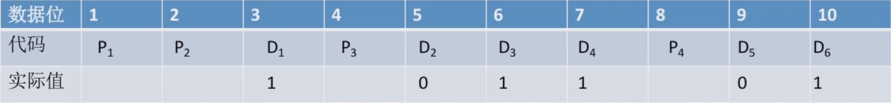

3. 求出校验码的值 
根据校验码的数据位的二进制位形式，只要数据位和校验码在相同位置出现了`1`，那么我们就将这些数据位与校验码归为一组，令一组中的所有位异或`=0`。

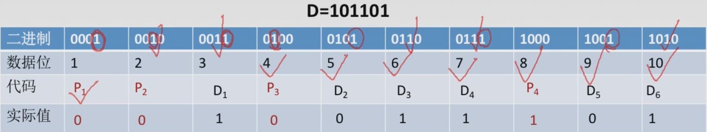

4. 检错并纠错
根据之前数据位和校验位形成的分组，在接受端重新进行异或运算，将第`1`个校验码所在的分组记为第一组，...，第`n`个校验码所在的分组记为第`n`组，最终将每组得到的异或结果从`n`到`1`组合起来形成一个二进制序列，这个二进制序列对应的十进制数就是出错的位数。

## 流量控制与可靠传输机制
### 数据链路层的流量控制
较高的发送错误和较低的接受能力的不匹配，会造成传输出错，因此流量控制也是数据链路层的一项重要工作。

数据链路层的流量控制是点对点的，而传输层的流量控制是端到端的。

数据链路层流量控制手段：接收方收不下就不回复确认。 
传输层流量控制手段：接受端给发送端一个窗口公告。

### 流量控制的方法
+ 停止-等待协议 每发送完一个帧之后，就停止发送，等待接收端的确认，在收到确认之后再发送下一个帧。
  
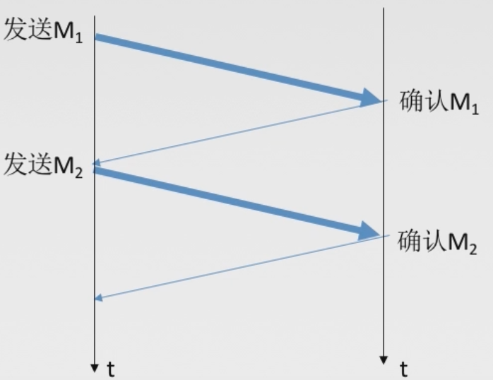

+ 滑动窗口协议
    + 后退`N`帧协议(`GBN`)
    + 选择重传协议(`SR`)

其中停止-等待协议是一种特殊的滑动窗口协议。

+ 停止-等待协议 发送窗口大小 `= 1`，接收窗口大小 `= 1`
+ 后退`N`帧协议(`GBN`) 发送窗口大小 `> 1`，接收窗口大小 `= 1`
+ 选择重传协议(`SR`) 发送窗口大小`> 1`，接收窗口大小 `> 1`

### 可靠传输、滑动窗口、流量控制
+ 可靠传输：发送端发送什么样的数据，接受端就要接受到什么样的数据，之前的差错控制因为只能检验出是不是出现了错误(有的时候一些错误还检验不出来)，如果我们使用`CRC`(循环冗余校验)，也只能实现无比特差错的传输，但是因为会将出现错误的数据直接丢弃，所以并不是可靠传输。
+ 流量控制：控制发送速率，使接收方有足够的缓冲空间来接收每一个帧。

## 停止等待协议
丢包：物理线路、设备故障、病毒攻击、路由信息错误等原因，会导致数据包的丢失。 
为了解决丢包以及实现流量控制，需要停止等待协议。
### 无差错情况

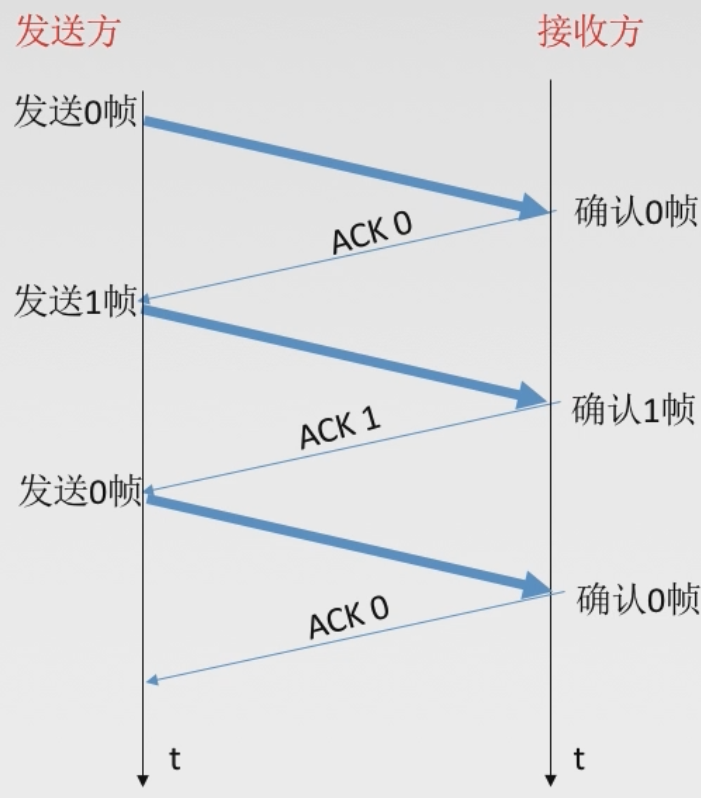

### 数据帧丢失或检测到帧出错

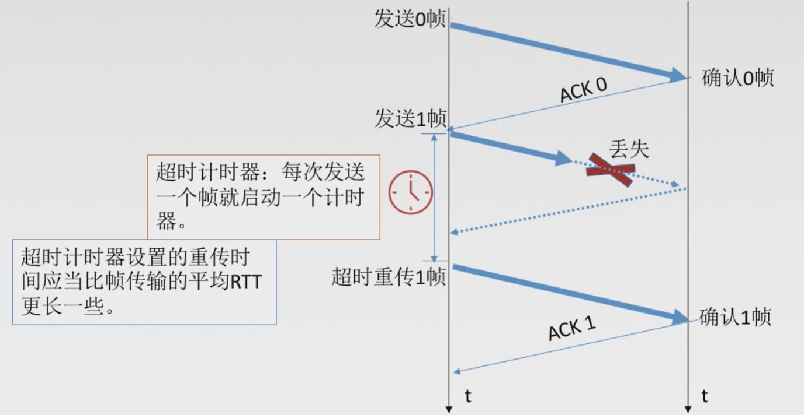

1. 发送一个帧后，必须保留它的副本。
2. 数据帧和确认帧必须编号。

### ACK丢失

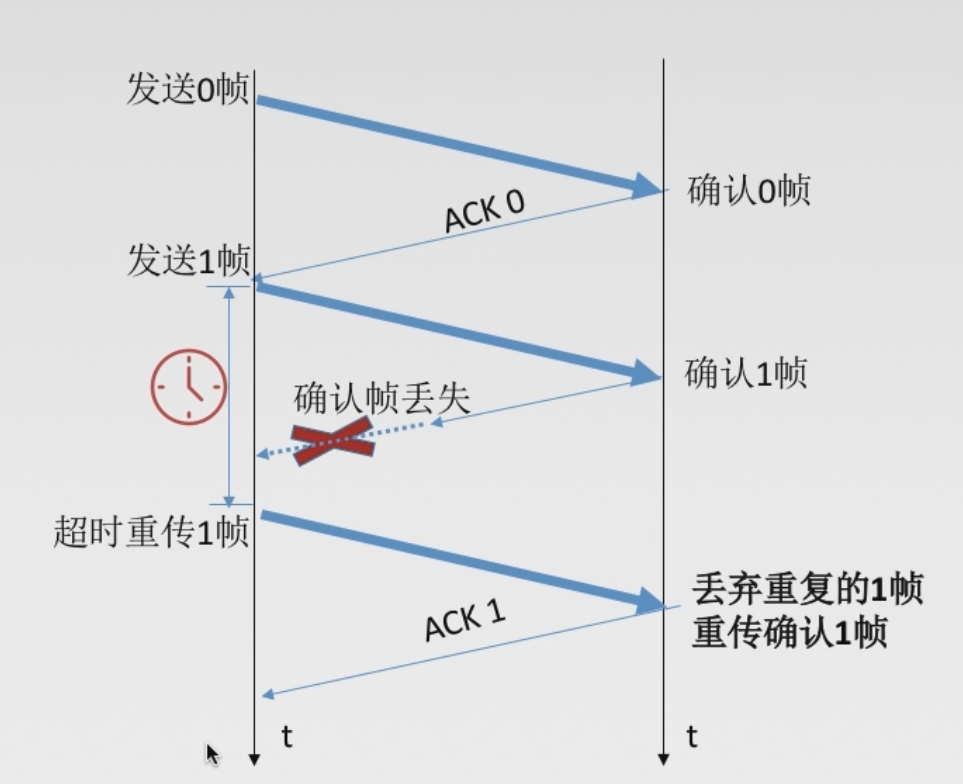

### ACK迟到

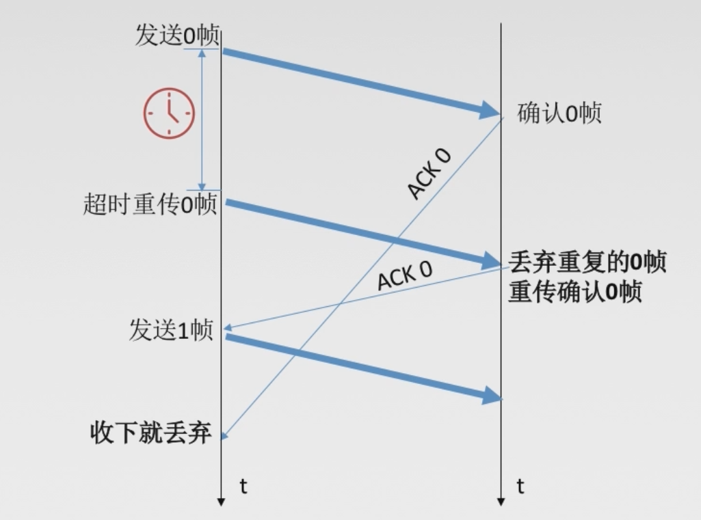

### 性能分析
停止等待协议有以下两个特点:
+ 简单
+ 信道利用率太低

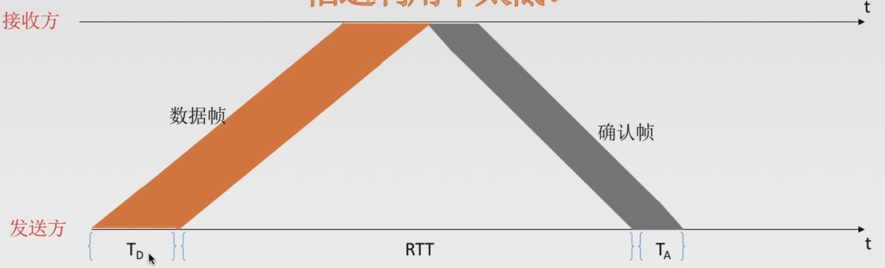

信道利用率$U = \frac{T_{D}}{T_{D} + RTT + T_{A}}$

信道利用率: 发送方在一个发送周期内，有效地发送数据所需要的时间占整个发送周期的比率。

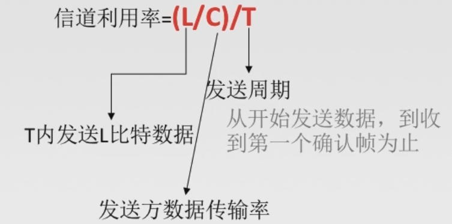

信道吞吐率 = 信道利用率 * 发送方的发送速率

## `GBN`协议
停止-等待协议存在着信道利用率低的问题。从而提出了两个新的协议`GBN`以及`SR`。

发送窗口：发送方维持一组连续的允许发送的帧的序号。 

接收窗口：接收方维持一组连续的允许接收帧的序号。

发送窗口的大小大于`1`，但是接收窗口的大小等于`1`。

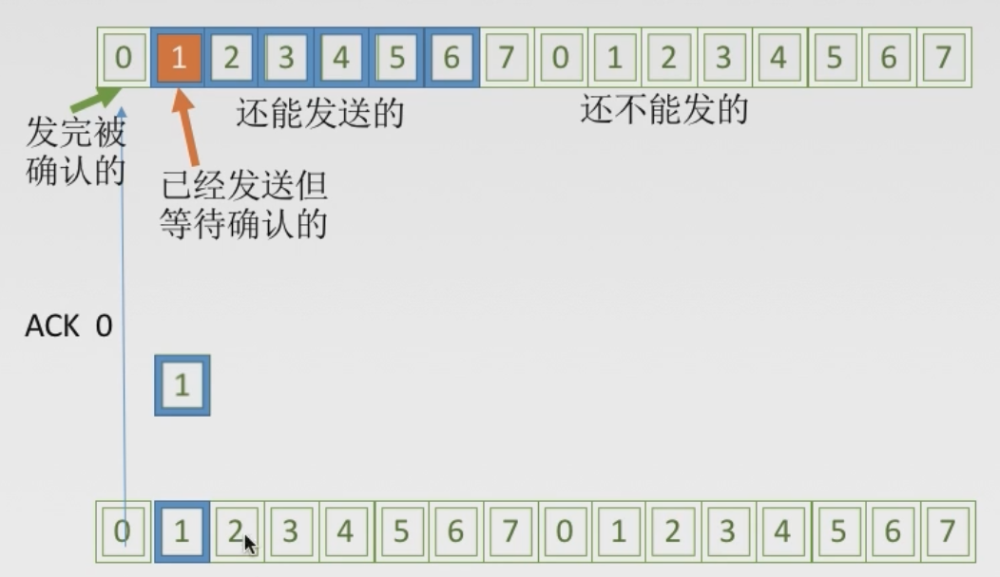

### `GBN`发送方必须相应的三件事
1. 上层的调用

2. 收到了一个`ACK` 
`GBN`协议中，对`n`号帧的确认采用**累积确认**的方式，标明接收方已经收到`n`号帧和它之前的全部帧。

3. 超时事件

例子：假如发送方发送了从`0`至`5`编号的`6`个帧，在这个过程中`1`号帧发生错误或者丢失，这样的话，发送方只能够收到`0`号帧的确认，接收方即使收到`2`至`5`号帧，也不会接收，会全部抛弃，这样的话，尽管发送方已经发送了`6`个帧，依旧要退回到`1`号帧进行重传。

### `GBN`接收方要做的事
如果正确收到`n`号帧，并且按序(`n`号帧前面的帧也全都收到了)，那么接收方为`n`帧发送一个`ACK`，并将该帧中的数据部分发送给上层。 
其余情况都丢弃帧，并为最近按序接收的帧重新发送`ACK`。接受方无需缓存任何失序帧，只需要维护一个信息: `expectedseqnum`(下一个按序接受的帧序号)

### 运行中的`GBN`

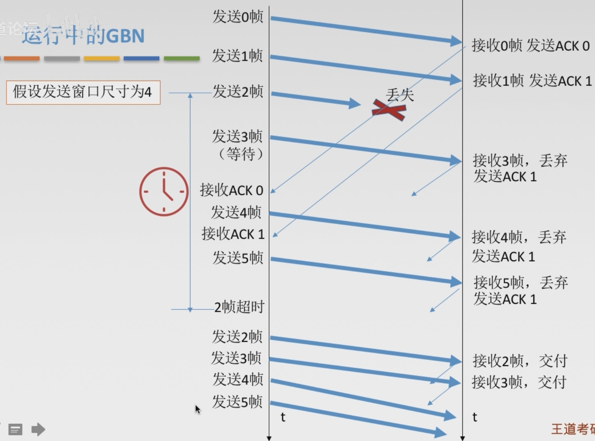

### 滑动窗口长度
窗口的长度不可能无限，若采用`n`个比特对帧编号，那么发送窗口的尺寸$W_{T}$应该满足：$1\leq W_{T}\leq 2^{n} - 1$。 
因为发送窗口尺寸过大，就会使得接收方无法区别新帧和旧帧。